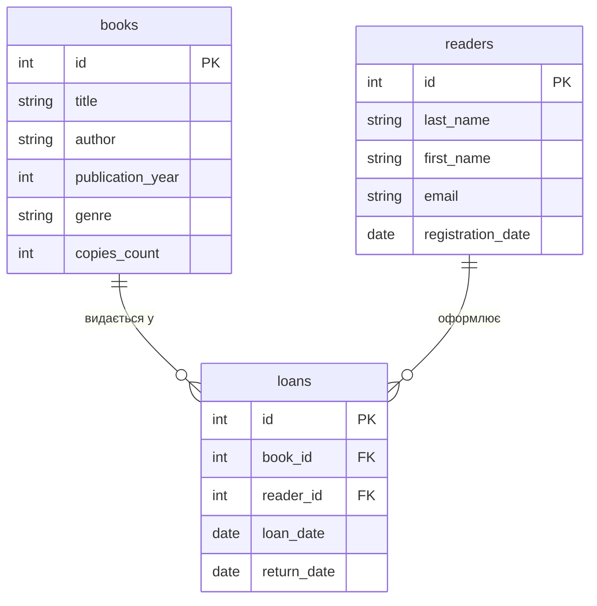

# Практика 3. ER-діаграма для варіанта "Бібліотека"

**Варіант № 1 — Бібліотека**

**Схема:** `books` (вимір 1), `readers` (вимір 2), `loans` (фактова з двома FK)

---

## Завдання 1. ER-діаграма повної схеми



---

## Завдання 2. Тип кожного зв'язку

**Зв'язок `books ||--o{ loans` — 1:N.**
Одна конкретна книга відповідає нулю або багатьом записам про видачу: ту саму книгу за час роботи бібліотеки видають багато разів (або жодного разу, якщо примірник щойно надійшов і ще не видавався). Натомість кожен конкретний запис у `loans` посилається рівно на одну книгу — не можна в одному записі видати одразу дві різні книги. Отже, з боку `books` — "один", з боку `loans` — "багато".

**Зв'язок `readers ||--o{ loans` — 1:N.**
Один читач відповідає нулю або багатьом записам про видачу: постійний читач бере книги десятки разів за рік, новий читач у базі — поки жодного разу, але кожен запис у `loans` оформлений рівно одним читачем. Отже, з боку `readers` — "один", з боку `loans` — "багато".

Прямого зв'язку між `books` і `readers` на діаграмі немає — вони пов'язані лише через `loans`. Це типова роль фактової таблиці: вона з'єднує дві вимірні таблиці, які одна з одною напряму не пов'язані.

---

## Завдання 3. Первинні й зовнішні ключі кожної таблиці

**Таблиця `books` (вимірна 1):**
- (а) Первинний ключ: `id`.
- (б) Зовнішніх ключів немає.

**Таблиця `readers` (вимірна 2):**
- (а) Первинний ключ: `id`.
- (б) Зовнішніх ключів немає.

**Таблиця `loans` (фактова):**
- (а) Первинний ключ: `id`.
- (б) Зовнішні ключі:
  - `book_id` → посилається на `books(id)`;
  - `reader_id` → посилається на `readers(id)`.

Обидва зовнішні ключі мають той самий абстрактний тип `int`, що й первинні ключі, на які вони посилаються (`books.id` і `readers.id` — теж `int`). Рівно два FK у фактовій таблиці — по одному на кожну вимірну таблицю.

---

## Завдання 4. Якщо додати ще одну сутність

Припустимо, до предметної області "Бібліотека" треба додати **видавництва** (`publishers`). Кожна книга видана одним видавництвом; одне видавництво за свою історію видало багато книг.

**Нова таблиця:**
```
publishers {
    int id PK
    string name
    string city
    string email
}
```

**Як зміниться діаграма:**

До `books` додається новий стовпець-зовнішній ключ `publisher_id`, який посилається на `publishers(id)`. На діаграмі з'являється новий зв'язок:

```
publishers ||--o{ books : "видає"
```

- **Тип зв'язку: 1:N.** Одне видавництво видає нуль або багато книг (у нового видавництва в каталозі бібліотеки може поки не бути жодної книги), але кожна конкретна книга видана рівно одним видавництвом — не буває так, щоб один і той самий примірник вийшов одночасно у двох видавництвах як одна позиція.
- **Напрямок зв'язку:** від `publishers` (вимір) до `books` (теж вимір, але тепер залежний). Новий FK `publisher_id` живе в `books`, а не в `loans`, бо видавництво стосується самої книги, а не акту її видачі читачеві.

Загальна структура після цього: три вимірні таблиці (`publishers`, `books`, `readers`) і фактова `loans`, яка, як і раніше, має рівно два FK — `book_id` і `reader_id`.

---

## Завдання 5. Порівняння з прикладом (хімчистка)

Діаграма "Бібліотека" структурно ідентична прикладу з хімчисткою (`services`, `clients`, `orders`):

| Ознака | Хімчистка | Бібліотека |
|---|---|---|
| Вимірна таблиця 1 | `services` | `books` |
| Вимірна таблиця 2 | `clients` | `readers` |
| Фактова таблиця | `orders` | `loans` |
| FK у фактовій | `service_id`, `client_id` | `book_id`, `reader_id` |
| Зв'язок 1 | `services \|\|--o{ orders` — 1:N | `books \|\|--o{ loans` — 1:N |
| Зв'язок 2 | `clients \|\|--o{ orders` — 1:N | `readers \|\|--o{ loans` — 1:N |
| Прямий зв'язок між вимірами | немає | немає |

Обидві схеми складаються з **двох вимірних таблиць і однієї фактової з двома FK**. В обох випадках обидва зв'язки — 1:N, і в обох випадках дві вимірні таблиці пов'язані **лише через фактову**, а не напряму. Це не випадковий збіг, а загальний шаблон "зіркоподібної" схеми: фактова таблиця описує подію (видача книги / приймання речі в хімчистку), а кожна вимірна — учасника цієї події (книга + читач / послуга + клієнт). Різняться лише назви сутностей, конкретні атрибути й предметна семантика — архітектура ж залишається тією самою.

---

## Контрольні питання

### 1. Чим логічна модель відрізняється від концептуальної, і чим фізична — від логічної?

**Концептуальна** модель описує предметну область "як її бачить замовник": сутності (`Книга`, `Читач`, `Видача`) та зв'язки між ними, без жодних деталей реалізації — ні типів, ні ключів, ні назв таблиць. Це найвищий, найабстрактніший рівень.

**Логічна** модель уточнює концептуальну до рівня, зрозумілого СУБД: у кожної сутності з'являються атрибути з абстрактними типами (`int`, `string`, `date`), позначаються первинні (`PK`) і зовнішні (`FK`) ключі, визначаються кардинальності зв'язків (1:N, M:N). Саме на цьому рівні працює mermaid `erDiagram` — він **не прив'язаний до конкретної СУБД**, тому тип `int` тут може стати `INTEGER` у SQLite, `SERIAL` у PostgreSQL або `INT` у MySQL.

**Фізична** модель — це вже конкретна реалізація в обраній СУБД: точні типи (`INTEGER PRIMARY KEY` у SQLite), індекси, обмеження `NOT NULL`, розташування файлів, стратегії зберігання. Той самий логічний стовпець `int id PK` у SQLite стане `id INTEGER PRIMARY KEY`, а в PostgreSQL — `id SERIAL PRIMARY KEY`: логіка та сама, фізика різна.

Коротко: **концептуальна** — "що є в предметній області", **логічна** — "як це подати у вигляді таблиць і ключів", **фізична** — "як це реально зберегти в конкретній СУБД".

### 2. Чому зв'язок M:N не можна реалізувати двома зовнішніми ключами в одній із двох основних таблиць і завжди потрібна окрема таблиця?

У зв'язку M:N **один рядок таблиці A може бути пов'язаний із багатьма рядками таблиці B, і навпаки**. Якщо спробувати реалізувати це одним FK у таблиці A (скажімо, `books.reader_id → readers.id`), то кожен рядок `books` зможе вказати лише на **одного** читача — вийде зв'язок 1:N, а не M:N. Симетрично не вийде й з FK у таблиці `readers`.

Приклад із бібліотеки: якби одна книга могла бути лише в одного читача — це було б 1:N, і тоді FK `reader_id` жив би прямо в `books`. Але насправді читач бере багато книг одночасно, а книга за свою історію потрапляє до багатьох читачів — це **M:N**. Щоб реалізувати його, потрібна **третя, сполучна таблиця** (`loans`), яка містить **два FK** — по одному на кожну з основних таблиць. Кожен рядок такої сполучної таблиці фіксує одну конкретну пару "книга ↔ читач" (плюс атрибути самої події: `loan_date`, `return_date`).

Формально: **M:N завжди розкладається на дві 1:N** через проміжну таблицю. Це не "незручність SQL", а прямий наслідок реляційної моделі: один FK в одному рядку може вказати лише на один рядок іншої таблиці. Саме тому фактова таблиця `loans` і має рівно **два** зовнішні ключі — по одному на кожну вимірну таблицю.

### 3. Що означають позначення `||`, `o{`, `|{` у синтаксисі mermaid erDiagram, і як прочитати вголос рядок `A ||--o{ B`?

Позначення стоять на **кінцях лінії зв'язку** й описують кардинальність із боку відповідної сутності. Символ складається з двох частин: **лінія** (скільки) і **кругла/фігурна дужка** (обов'язковість).

| Символ | Значення |
|---|---|
| `\|\|` | рівно один (обов'язково один) |
| `o\|` | нуль або один (необов'язковий один) |
| `}o` / `o{` | нуль або багато (необов'язково багато) |
| `}\|` / `\|{` | один або багато (обов'язково хоча б один) |

**Рядок `A ||--o{ B` читається вголос так:**
> "Один `A` може мати нуль або багато `B`; але кожен `B` належить рівно одному `A`."

Тобто **зліва** (бік `A`) — `||` = "рівно один", **справа** (бік `B`) — `o{` = "нуль або багато". Разом це стандартний зв'язок **1:N** з боку `A`: один `A` — багато `B`, і кожен `B` — рівно один `A`.

У нашій схемі `books ||--o{ loans` читається:
> "Одна книга може мати нуль або багато записів про видачу; але кожен запис про видачу стосується рівно однієї книги".

А `readers ||--o{ loans` читається:
> "Один читач може мати нуль або багато записів про видачу; але кожен запис про видачу оформлений рівно одним читачем".